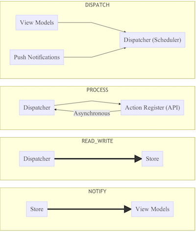

# Unidirectional Architecture Proposal

This document proposes a new architecture for Toggl mobile apps to simplify the different app layers and the exchanges among them. The overall pattern can be seen in the following diagram.

> The thick arrows represent subscriptions to Rx Observables.

The **View Models** won't change much from the current model. They will contain most of the view logic in a common project (Phoebe) and notify the platform-specific objects through a framework like MVVM Light. The main difference is ``View Models`` shouldn't perform any I/O operation by themselves but send messages to the ``Dispatcher`` and wait for a notification from the ``Store``.

The **Dispatcher** should be a simple class in charge of receiving requests from the ``View Models`` (using the [Reactive Extensions]() scheduler), process them with the appropriate callback from the ``Action Register`` and send the result to the ``Store`` (also through a Rx Observable).
> The requests may contain arguments and must be identified with a **tag**. This applies to every message handled by Rx Observables.

The **Action Register** acts as the application internal API. In its simplest form, it will be a dictionary with the signature: ``Dictionary<string, Func<object, Task<object>>``.

The **Store** is the only class which can read and write from the local database. No other class can have access to it. The ``Store`` will have its own API in the form of *predefined queries* (sort of stored procedures). 

 
## Examples

It's probably easier to imagine the new workflow with some specific examples.

### **Load More Time Entries**

1. DISPATCH: The ``View Model`` receives a request to display more items, so it sends a message to the ``Dispatcher`` with a tag (e.g. *LOAD_MORE_TIME_ENTRIES*) and shows the loading icon.
> The loading icon must be a property of the ``View Model``.

2. PROCESS: There must be a callback in the ``Action Register`` for the request tag. This callback will try to download entries from the internet served in the requested time frame.
> There may be a cache to decide in advance whether the call to the server is necessary or not.

3. READ_WRITE: This step depends on the message coming from the ``Dispatcher``. a) If the entries have been correctly downloaded from the server, the ``Store`` will **write** them to the database; b) if not, it'll try to **read** the local data instead.

4. NOTIFY: The ``View Model`` receives a notification from the ``Store``, updates the time entries' collection accordingly and hides the loading icon.
> It's important the ``Store`` launches the notification, even if there're no more items, to hide the loading icon.

### **Remove a Time Entry** (WIP)

1. DISPATCH

2. PROCESS

3. READ_WRITE

4. NOTIFY

 
## Advantages of this proposal

* This architecture is a good fit for the MVVM pattern. Most of the view logic remains in the ``View Models`` (Phoebe), which send requests to the ``Dispatcher`` and receive notifications from the ``Store``.

* Just by opening the ``Action Register`` class, the programmer can see the API of the application. This class won't contain the whole logic for every operation but mostly calls to static methods of Helper classes.

* Models will be greatly simplified, as they cannot touch the database by themselves. Ideally, they would become dummy classes (no methods of their own) and the different versions (DataObject, Model, Json) would be unified.

* If the response to an action must be awaited, a ``Task`` can be constructed that will complete when a notification with a specific tag comes from the ``Store``.
